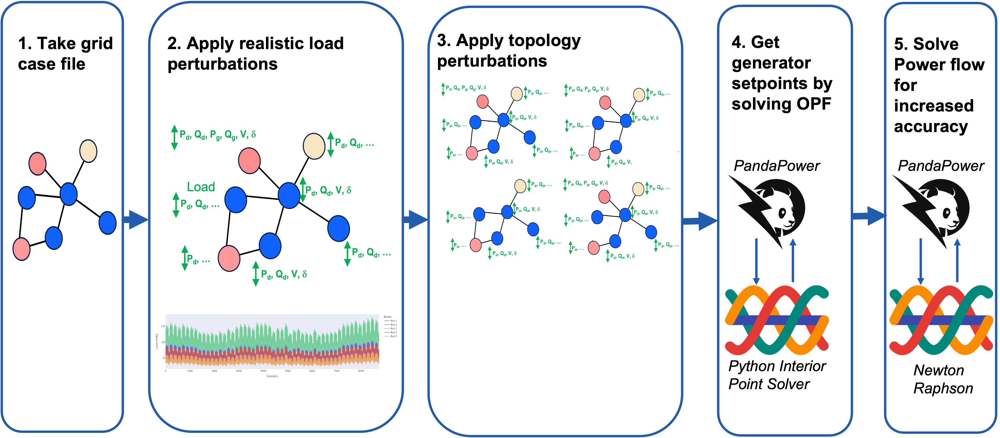

# GridFM model evaluation


This library is brought to you by the GridFM team to generate power flow data to train machine learning and foundation models.

---

# Workflow

<p align="center">
  
  <br/>
</p>


---


# Comparison with other PF datasets/ libraries

| Feature                                                    | GraphNeuralSolver | OPFData | OPFLearn | PowerFlowNet | TypedGNN | PF△ | **GridFM** |
| ---------------------------------------------------------- | ----------------- | ------- | -------- | ------------ | -------- | --- | ---------- |
| Generator Profile                                          | ✅                 | ❌       | ❌        | ✅            | ✅        | ✅   | ❌          |
| N-1                                                        | ❌                 | ✅       | ✅        | ✅            | ✅        | ✅   | ✅          |
| > 1000 Buses                                               | ❌                 | ✅       | ✅        | ❌            | ❌        | ✅   | ✅          |
| N-k, k > 1                                                 | ❌                 | ❌       | ❌        | ❌            | ❌        | ❌   | ✅          |
| Load Scenarios from Real World Data                        | ❌                 | ❌       | ❌        | ❌            | ❌        | ❌   | ✅          |
| Multi-processing and scalable to very large (1M+) datasets | ❌                 | ❌       | ❌        | ❌            | ❌        | ❌   | ✅          |


# Installation
1. Give the [repo](https://github.com/Grid-FM/grid_data_synthetic) a star on GitHub ;)

2. Create a python virtual environment and install the requirements:
```bash
git clone git@github.com:Grid-FM/grid_data_synthetic.git
cd grid_data_synthetic
python -m venv venv
pip install .
```
# Getting Started

## Option 1: Run data gen using interactive interface

To use the interactive interface, either open `scripts/interactive_interface` or copy the following into a Jupyter notebook and follow the instructions:

```python
from GridDataGen.interactive_utils import interactive_interface
interactive_interface()
```

<br>

## Option 2: Using the command line interface

Run the data generation routine from the command line:

```bash
gridfm_data path/to/config.yaml
```

<br>

## Configuration Overview


Sample configuration files are provided in `scripts/config`, e.g. `default.yaml`:

```yaml
network:
  name: "case24_ieee_rts"          # Name of the power grid network
  source: "pglib"                  # Data source; options: pglib, pandapower, file
  network_dir: "grids"             # Directory containing the network files

load:
  generator: "agg_load_profile"    # Load generator; options: agg_load_profile, powergraph
  agg_profile: "default"           # Aggregated load profile name
  scenarios: 200                   # Number of load scenarios to generate
  sigma: 0.05                      # Max local noise
  change_reactive_power: true      # Whether to change reactive power values
  global_range: 0.4                # Lower bound offset for global scaling factor
  max_scaling_factor: 4.0          # Upper bound for global scaling factor
  step_size: 0.025                 # Step size for scaling factor search
  start_scaling_factor: 0.8        # Starting value for scaling factor

topology_perturbation:
  k: 1                             # Max number of components to drop per perturbation
  n_topology_variants: 5           # Number of perturbed topologies per scenario
  type: "random"                   # Perturbation type; options: n_minus_k, random, overloaded, none
  elements: ["line", "trafo", "gen", "sgen"]  # Elements to perturb

settings:
  num_processes: 10                # Number of parallel processes
  data_dir: "../data_test"         # Output directory for generated data
  large_chunk_size: 50             # Number of scenarios processed before saving
  no_stats: false                  # Disable statistical calculations if true
  overwrite: true                  # Overwrite existing files if true
  mode: "pf"                       # Run mode; options: contingency, pf
```

<br>

# Output Files

The data generation process produces several output files in the specified data directory:

- **node_data.csv**: Contains data related to the nodes (buses) in the network, such as voltage levels and power injections.
- **edge_data.csv**: Contains data related to the edges (lines and transformers) in the network, such as impedance and power flow.
- **branch_indices.csv**: Lists the indices of the branches (lines and transformers) in the network.
- **edge_params.csv**: Contains parameters for the edges, such as resistance and reactance.
- **bus_params.csv**: Contains parameters for the buses, such as voltage limits and power limits.
- **scenarios.csv**: Contains the generated load scenarios.
- **scenarios_plot.html**: An HTML file with plots of the load scenarios.
- **scenarios_log**: A log file containing information about the generation of load scenarios.
- **stats.csv**: Contains statistical data about the network, such as the number of generators, lines, transformers, overloads, and maximum loading.
- **stats_plot.html**: An HTML file with plots of the network statistics.
